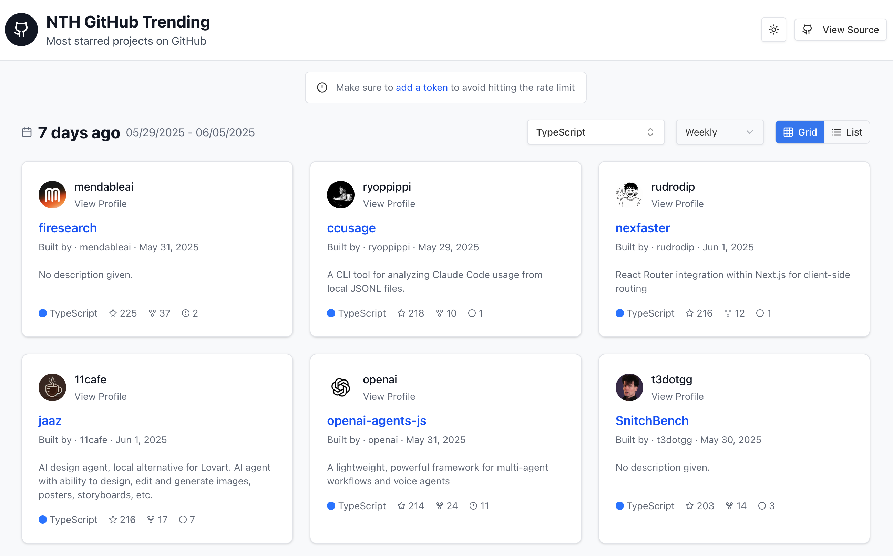

# NTH GitHub Trending

A modern web application that displays trending GitHub repositories based on customizable time periods and programming languages.



## Overview

NTH GitHub Trending is a React application that helps developers discover popular repositories on GitHub. The app leverages the GitHub API to fetch trending repositories based on specific criteria such as:

- Time period (daily, weekly, monthly)
- Programming language
- Star count

The application features a clean, modern UI built with React and Tailwind CSS, with a responsive design that works across devices.

## Features

- 📊 View trending repositories with detailed information
- 🗓️ Filter repositories by different time periods
- 🔠 Filter repositories by programming language
- 🔄 Infinite scrolling for browsing more repositories
- 🔍 GitHub authentication support for increased API rate limits
- 🎨 Light/dark theme toggle
- 📱 Fully responsive design

## Tech Stack

- **Frontend Framework**: React 19
- **Router**: TanStack Router
- **API Client**: TanStack Query
- **UI Components**: Custom UI components built with Radix UI primitives
- **Styling**: Tailwind CSS
- **State Management**: Zustand
- **Date Handling**: date-fns
- **Build Tool**: Vite
- **Language**: TypeScript

## Getting Started

### Prerequisites

- Node.js (v18 or higher recommended)
- npm, yarn, or Bun

### Installation

1. Clone the repository:

```bash
git clone https://github.com/yourusername/nth-github-trending.git
cd nth-github-trending
```

2. Install dependencies:

```bash
# Using npm
npm install

# Using yarn
yarn install

# Using bun
bun install
```

3. Start the development server:

```bash
# Using npm
npm run dev

# Using yarn
yarn dev

# Using bun
bun run dev
```

4. Open your browser and navigate to `http://localhost:3000`

## Project Structure

```
nth-github-trending/
├── public/                 # Public assets
├── src/
│   ├── api/                # API integration
│   ├── components/         # Reusable React components
│   │   └── ui/             # UI components (buttons, cards, etc.)
│   ├── constants/          # Application constants
│   ├── hooks/              # Custom React hooks
│   ├── lib/                # Utility functions
│   ├── routes/             # Application routes
│   ├── utils/              # Helper functions
│   ├── main.tsx            # Application entry point
│   ├── routeTree.gen.ts    # Generated route tree
│   ├── styles.css          # Global styles
│   └── types.ts            # TypeScript type definitions
├── index.html              # HTML template
├── package.json            # Project dependencies
└── vite.config.js          # Vite configuration
```

## Usage

### Filtering Repositories

1. Use the date selector to choose a time period (daily, weekly, monthly)
2. Select a programming language from the dropdown menu
3. Browse trending repositories that match your criteria

### Adding a GitHub Token

To avoid GitHub API rate limits, you can add your personal access token:

1. Click on the "Add Token" button
2. Create a token on GitHub with appropriate permissions
3. Paste your token in the modal and save

## Building for Production

To build the application for production:

```bash
# Using npm
npm run build

# Using yarn
yarn build

# Using bun
bun run build
```

The build artifacts will be stored in the `dist/` directory.

## Deployment

This project can be deployed to any static hosting service, such as:

- GitHub Pages
- Netlify
- Vercel
- Cloudflare Pages

## Contributing

Contributions are welcome! Please feel free to submit a Pull Request.

1. Fork the repository
2. Create your feature branch: `git checkout -b feature/amazing-feature`
3. Commit your changes: `git commit -m 'Add some amazing feature'`
4. Push to the branch: `git push origin feature/amazing-feature`
5. Open a pull request

## License

This project is licensed under the MIT License - see the LICENSE file for details.

## Acknowledgments

- GitHub API for providing repository data
- All the open-source libraries used in this project
